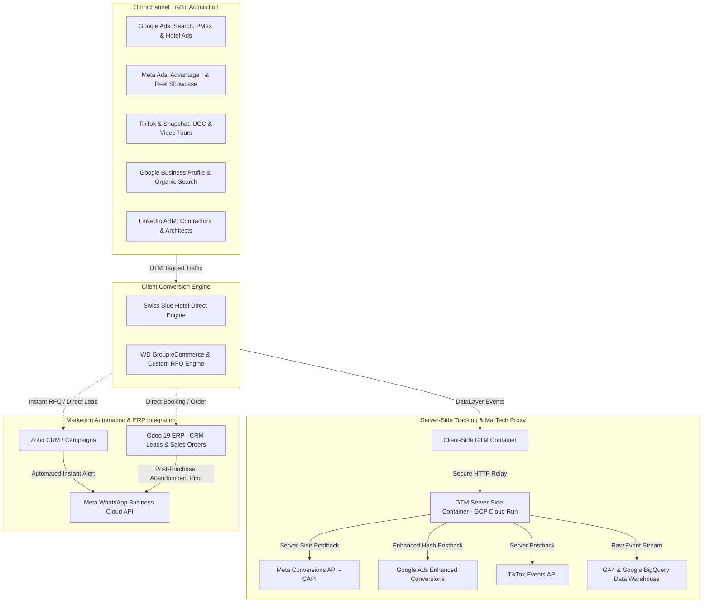
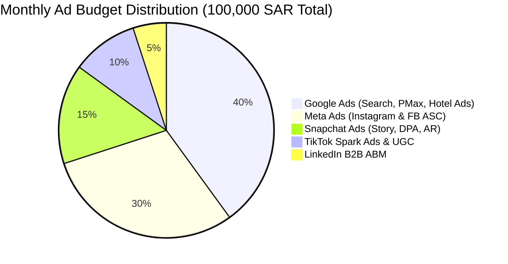

# Digital Marketing Growth Strategy & Attribution Hub
## Definitive Enterprise Operations Manual & Strategic Execution Guide

**Document ID:** DIC-DOC-MKT-006  
**Version:** 1.0  
**System Class:** Omnichannel Growth Engine, Server-Side MarTech Stack, Conversion Rate Optimization (CRO) & Attribution Intelligence  
**Target Enterprise:** WD Group Holdings, Swiss Blue Hotels & Serviced Apartments, and Dubai in Cairo Partner Brands  
**Canonical Reporting & Analytics Hubs:**
- **Google Analytics 4 (GA4):** Property ID: `GA4-WDG-SB-2026` (Data Streams: Web & Lead Portals)
- **Google Tag Manager (Server-Side):** Container ID: `GTM-SS-DC884` (Google Cloud Staging Proxy)
- **Meta Business Manager:** Portfolio ID: `META-BIZ-WDGROUP` (Pixel & CAPI ID: `10928374829104`)
- **TikTok Business Center:** Advertiser ID: `TT-ADV-7392810` (Events API Server-Side)
- **Snapchat Ads Manager:** Organization ID: `SNAP-ORG-KSA-4910` (Conversions API)
- **CRM & Automation Connectors:** Zoho CRM / Zoho Campaigns + Meta WhatsApp Business Cloud API + Odoo 19 ERP Leads  
**Date of Release:** September 2026  

---

## 1. Executive Summary & Strategic Context

### 1.1 Organizational Context
The **Dubai in Cairo Integrated Technology Suite** provides robust enterprise infrastructure across hospitality (`swissblue23may`), luxury commercial timber & bespoke furniture (`wd-group-website`), industrial manufacturing (`Odoo 19 ERP`), and automated financial reconciliation (`Ozoo`).

While technical and operational excellence are established, enterprise profitability and asset utilization in the Kingdom of Saudi Arabia (KSA) and GCC require an aggressive, automated, and continuous **upstream demand-generation and customer acquisition engine**:
1. **Swiss Blue Hotels:** Driving direct, high-margin booking volume across 6 properties (Riyadh, Jeddah, Jazan), dramatically slashing OTA commission dependency (saving 18%–25% per booking), and maximizing Average Daily Rate (ADR) and Revenue Per Available Room (RevPAR).
2. **WD Group Commercial & Joinery:** Attracting high-net-worth Saudi homeowners (HNWIs), villa developers, interior design firms, and tier-1 contractors for bespoke luxury doors, kitchens, and architectural joinery, achieving high Average Order Value (AOV) and lifetime value (LTV).

### 1.2 Historical Growth Pain Points Prior to Dubai in Cairo
Prior to implementing this centralized digital marketing strategy, group operations faced significant growth bottlenecks:
- **Severe OTA Commission Erosion:** Swiss Blue relinquished up to 25% of top-line revenue to Booking.com and Agoda because prospective hotel guests found OTAs before Swiss Blue's direct website.
- **Disconnected Ad Spend & Zero Conversion Attribution:** Ad spend on Instagram and Snapchat lacked server-side event tracking. When Apple iOS 14.5+ ATT (App Tracking Transparency) eliminated 3rd-party cookies, reported ROAS dropped by 60% due to signal loss.
- **Leads Abandoned in Silos:** Inbound furniture inquiries and RFQs submitted via social forms were stored in raw CSVs rather than syncing into Odoo ERP and Zoho CRM, resulting in 48-hour response delays and lost high-value fit-out contracts.
- **Generic Non-Localized Messaging:** Campaigns did not leverage Saudi-specific cultural calendars (e.g. Saudi National Day, Foundation Day, Ramadan hospitality packages, Riyadh Season fit-outs) or native Saudi vernacular.

### 1.3 Project Mandate & Primary Objectives
Dubai in Cairo engineered and deployed this definitive **Digital Marketing Growth Strategy** to achieve four non-negotiable milestones:
1. **Drive Direct Booking Share to > 45%:** Shift hospitality guest acquisition from third-party OTAs to direct web bookings via tailored search and social ad funnels.
2. **Attain Blended ROAS > 5.5x:** Maintain high-margin returns across paid media through precision audience targeting and automated bidding algorithms (Google Smart Bidding & Meta ASC).
3. **Establish 100% Signal Integrity via Server-Side Tracking:** Implement Google Tag Manager Server-Side (GTM SS), Meta Conversions API (CAPI), and TikTok Events API with cryptographic SHA-256 parameter hashing and event deduplication (`event_id`).
4. **Accelerate Lead-to-Quote Cycle to < 15 Minutes:** Integrate Meta and Webhook lead forms directly with Odoo CRM and Zoho Cliq to alert sales engineers instantly via WhatsApp Cloud API.

---

## 2. Integrated MarTech Architecture & Data Flow

The diagram below illustrates how paid search, social platforms, local SEO, server-side tracking, and CRM automation interconnect with our deployed eCommerce and hotel platforms:



---

## 3. High-Impact Acquisition Channels & Execution Playbooks

### 3.1 Google Ads Engine: High-Intent Search, PMax & Hotel Ads
Google Ads captures immediate commercial and booking intent when customers are actively searching in Riyadh, Jeddah, and GCC:

| Campaign Type | Primary Target Audience | Core Keyword Themes / Assets | Target Bidding Strategy | Expected Benchmark KPI |
| :--- | :--- | :--- | :--- | :--- |
| **Swiss Blue Brand Defense & High-Intent** | Business & leisure travelers searching for Swiss Blue or central Riyadh suites. | `فنادق سويس بلو`, `حجز فندق سويس بلو`, `Swiss Blue Riyadh Hotel`, `Swiss Blue serviced apartments` | Target Impression Share (> 90% Absolute Top of Page) | CPC < 1.80 SAR, ROAS > 8.0x |
| **Swiss Blue Non-Brand Location Search** | Travelers seeking luxury accommodation near Riyadh business hubs. | `شقق مفروشة حي الروضة`, `فنادق شمال الرياض`, `luxury serviced suites Riyadh`, `extended stay Riyadh` | Target CPA (< 45 SAR per booking) | Booking Conversion Rate > 4.2% |
| **Google Hotel Center (GHA & Free Booking Links)** | Meta-search users comparing prices on Google Maps & Google Travel. | Dynamic live room rates fed via PMS integration & Google Hotel Ads API. | Commission (Pay-per-Stay / 10%) | Direct Bookings vs OTA: 1:1 parity |
| **WD Group Luxury Timber Search** | Villa owners & contractors searching for premium joinery. | `تفصيل ابواب خشب طبيعي بالرياض`, `مطابخ خشب زان فاخرة`, `توريد اخشاب مشاريع فندقية`, `solid wood doors KSA` | Target ROAS (500%) / Maximize Conversions | Cost per Lead < 85 SAR |
| **WD Group Performance Max (PMax)** | High-intent furniture shoppers across YouTube, Display, Search & Discover. | High-res product studio shots, 3D wood grain videos, dynamic Merchant Center feed. | Maximize Conversion Value with Target ROAS (450%) | ROAS > 4.5x, Cart Abandonment < 55% |

### 3.2 Meta Advertising Stack (Instagram & Facebook)
Meta represents the core visual discovery and consideration channel in Saudi Arabia:
- **Advantage+ Shopping Campaigns (ASC):** Automatically allocates budget across top-converting wood furniture and suite showcases based on dynamic catalog feeds.
- **Architectural & Hospitality Reels:** 9:16 vertical short-form video featuring:
  - *Behind-the-Scenes Joinery:* CNC timber cutting, manual hand-buffing of walnut doors at the Najran and Riyadh plants.
  - *Hotel Room Walkthroughs:* 4K cinematic walkthroughs of Swiss Blue Tulip and Vinas suites highlighting kitchenettes, luxury linens, and keyless check-in.
- **Instant Experience & Native Lead Gen Forms:** For high-ticket custom fit-outs, users tap an ad and a pre-populated form loads in < 0.5 seconds, capturing name, verified Saudi phone number (`+966`), and project blueprint uploads.

### 3.3 TikTok & Snapchat: Saudi Visual Reach & Local Relevance
- **Snapchat Advertising (Highest KSA Daily Active Penetration):**
  - *Story Ads & Dynamic Product Ads (DPA):* Retargeting website visitors who viewed specific wood collections or hotel room types.
  - *Augmented Reality (AR) Portal Lenses:* Enabling users to virtually place a custom WD Group solid oak dining table or exterior door into their living room before ordering.
- **TikTok Spark Ads:**
  - Partnering with local Saudi interior design creators and Riyadh lifestyle vloggers to post organic reviews, then boosting the high-performing videos using TikTok Spark ad authorization codes.

### 3.4 LinkedIn Account-Based Marketing (ABM) for B2B Timber Contracts
- **Targeting Matrix:** Job Titles: *Procurement Director, Chief Architect, Senior Interior Designer, Hospitality Development Manager, Commercial Project Manager* located in Riyadh, Jeddah, and the Eastern Province.
- **Sponsored Content:** Whitepapers and project case studies: *"Specifying Certified Solid European Timber in Extreme Gulf Climates: How WD Group Delivers 25-Year Structural Guarantees."*

---

## 4. Organic SEO, Local Search & Content Authority

### 4.1 Local SEO & Google Business Profile (GBP) Optimization
Because 72% of hotel bookings and local furniture showroom visits originate on Google Maps, every property maintains an audited Google Business Profile:
- **NAP Consistency (Name, Address, Phone):** Standardized English and Arabic names matching registered municipal licenses.
- **Weekly Google Updates & Photo Uploads:** High-resolution interior photography, seasonal rate offers, and video walk-throughs posted bi-weekly.
- **Review Generation & Velocity Protocol:** Automated WhatsApp message sent 3 hours post-checkout inviting guests to leave a verified 5-star Google review. Target review velocity: minimum 15 reviews per week per property with 100% Arabic management response within 24 hours.

### 4.2 Structured Data Schema (JSON-LD)
All web templates inject schema markup validated via Google Search Console:
- **Swiss Blue Hotel:** `@type: Hotel` / `LodgingBusiness`, specifying `checkinTime`, `checkoutTime`, `amenityFeature`, `priceRange`, `geo` coordinates, and nested `containsPlace` for individual apartment units.
- **WD Group Products:** `@type: Product`, specifying `sku`, `gtin13`, `brand: "WD Group"`, `offers: { priceCurrency: "SAR", availability: "InStock" }`, and `review`.

---

## 5. Conversion Rate Optimization (CRO) & Funnel Architecture

### 5.1 Swiss Blue Direct Booking Funnel Optimization
To achieve a > 4.0% booking conversion rate:
1. **Sticky Floating Booking Bar:** On mobile devices, a persistent floating bottom bar displays room dates, guests, and a 1-click `"Book Direct & Save 10%"` button.
2. **Dynamic Scarcity Triggers:** Real-time indicator reading inventory directly: *"Only 2 Executive Suites left for your selected dates."*
3. **Transparent Price Guarantee:** Comparison box directly on the checkout screen:
   - Swiss Blue Direct: **420 SAR** (Includes Free Late Check-out & Wi-Fi)
   - Booking.com: **480 SAR**
4. **Instant WhatsApp Concierge Fallback:** A prominent WhatsApp floating button allowing travelers with custom requests to reserve directly through a front-desk agent.

### 5.2 WD Group eCommerce & B2B Custom Fit-Out Funnel
1. **Interactive Wood Specifier & Swatch Kit:** Customers can order a physical sample box containing 6 luxury wood swatches (American Walnut, White Oak, Teak, Ash) delivered to their door for 50 SAR (fully refunded upon their first order).
2. **Transparent Financing & Split-Pay Badges:** Prominent Tamara and Tabby widgets displaying: *"Or 4 interest-free payments of 425 SAR/mo"*.
3. **Moyasar 1-Click Checkout:** Instant Apple Pay and Mada authentication without requiring customer account registration.

### 5.3 Abandoned Funnel Recovery Matrix
When a user begins checkout but does not complete the transaction:

| Trigger Window | Channel | Content & Psychological Angle | Automation Tool |
| :--- | :--- | :--- | :--- |
| **+15 Minutes** | Automated WhatsApp Message | Soft assistance: *"Hello [Name], did you experience any issues finalizing your reservation at Swiss Blue? Reply 1 to chat with a concierge."* | Meta WhatsApp Cloud API via Webhook |
| **+2 Hours** | Dynamic Retargeting Ad | Shows exact room or furniture item viewed with social proof testimonial. | Meta CAPI & Google Dynamic Retargeting |
| **+24 Hours** | Personalized SMS / Email | Exclusive 24-hour incentive: *"Complete your WD Group order within 24 hours to receive complimentary white-glove installation across Riyadh."* | Brevo Transactional / Zoho Campaigns |

---

## 6. Server-Side Tracking, Data Governance & Attribution

### 6.1 Server-Side GTM & Meta Conversions API (CAPI) Topology
To bypass ad-blockers, iOS restrictions, and browser cookie expirations, all user interactions flow through a dedicated **Google Cloud Run Server-Side GTM Proxy**:

```
User Browser 
   │ (First-party event: purchase / booking)
   ▼
Edge Web Server (Next.js Reverse Proxy: /metrics/event)
   │
   ▼
Server-Side GTM Container (Cloud Run: stg.dubaiincairo.com)
   ├── Hashing: SHA-256 (Email, Saudi Mobile Phone with +966)
   ├── Deduplication: Unique event_id generated per transaction
   │
   ├──▶ Meta Conversions API (CAPI) [Match Quality: > 8.8/10]
   ├──▶ Google Ads Enhanced Conversions [Match Rate: > 75%]
   ├──▶ TikTok Events API [Match Rate: > 70%]
   └──▶ Google Analytics 4 & BigQuery Warehouse
```

### 6.2 Attribution Model & Marketing Efficiency Ratio (MER)
Rather than relying on single-touch attribution (e.g. Last Non-Direct Click) which undervalues top-of-funnel channels like TikTok and Snapchat:
- **Primary Model:** **Data-Driven Attribution (DDA)** in GA4 to evaluate each touchpoint's contribution.
- **Executive Metric:** **Blended Marketing Efficiency Ratio (MER)**:
  $$\text{MER} = \frac{\text{Total Gross Ecosystem Revenue (SAR)}}{\text{Total Ad Spend Across All Channels (SAR)}}$$
- **Target MER:** Minimum **5.5x** (e.g., spending 50,000 SAR on ads generates at least 275,000 SAR in verified direct revenue).

---

## 7. Budget Allocation, Target KPIs & Scaling Tiers

### 7.1 Recommended Monthly Ad Spend Allocation (100,000 SAR Baseline)



| Allocation Bracket | Monthly Spend (SAR) | Share (%) | Primary Role | Expected Return |
| :--- | :--- | :--- | :--- | :--- |
| **Google Ads** | 40,000 SAR | 40% | Bottom-of-funnel conversion (Brand search, high-intent keywords, Google Hotel Ads). | 240,000 SAR direct bookings / sales |
| **Meta Ads** | 30,000 SAR | 30% | Mid-to-bottom funnel visual conversion (Advantage+ Catalog, Reels, Lead Ads). | 180,000 SAR orders & RFQs |
| **Snapchat Ads** | 15,000 SAR | 15% | High-reach Saudi consideration, mobile retargeting, local demographics. | 75,000 SAR bookings & sales |
| **TikTok Ads** | 10,000 SAR | 10% | Viral awareness, creator collaboration, product craftsmanship discovery. | 45,000 SAR assisted revenue |
| **LinkedIn Ads** | 5,000 SAR | 5% | High-ticket B2B architect & procurement contractor lead generation. | 3 to 5 Tier-1 commercial quotes |
| **TOTAL** | **100,000 SAR** | **100%** | **Integrated Omnichannel Engine** | **> 540,000 SAR (Blended MER: 5.4x)** |

---

## 8. Standard Operating Procedures (SOPs)

### SOP MKT-01: Weekly Paid Ad Campaign Launch & A/B Creative Testing
- **Responsible Role:** Performance Marketing Specialist / Ad Operations Lead
- **Frequency:** Weekly (Every Monday at 09:00 Cairo Time)
- **Objective:** Introduce 3 new creative variations per ad set to prevent ad fatigue and identify winning visual hooks.
- **Trigger:** Ad creative frequency exceeds 3.2 or Cost Per Click (CPC) rises by > 20% over 7 days.
- **Action Steps:**
  1. Export creative performance reports from Meta Ads Manager and Google Ads for the previous 7 days.
  2. Identify underperforming ads (ROAS < 3.0x or CTR < 1.2%) and set them to paused.
  3. Prepare 3 new variations based on top hooks: 1 feature-benefit video, 1 customer UGC testimonial, 1 static carousel.
  4. Ensure all ad URLs have standardized UTM parameters:  
     `utm_source=[channel]&utm_medium=[paid_social|cpc]&utm_campaign=[campaign_name]&utm_content=[creative_id]`
  5. Deploy with an initial 15% daily budget allocation; test for 72 hours before scaling budget on winning assets.
- **Verification Checklist:**
  - [ ] Ad links load with valid 200 OK HTTP status.
  - [ ] UTM parameters populate correctly in GA4 Real-Time Debugger.
  - [ ] Arabic copy has zero typographical errors and adheres to Saudi dialect nuances.

---

### SOP MKT-02: Daily ROAS & Ad Spend Monitoring & Anomaly Escalation
- **Responsible Role:** Media Buyer / Marketing Officer
- **Frequency:** Daily at 10:00 and 17:00 Cairo Time
- **Objective:** Ensure daily spend pacing aligns with monthly budget caps and flag sudden conversion drops immediately.
- **Action Steps:**
  1. Log into Google Ads, Meta Ads Manager, and Snapchat Ads Manager.
  2. Verify total yesterday spend vs daily target ($\pm 10\%$ acceptable tolerance).
  3. Review blended ROAS and cost per acquisition (CPA):
     - Swiss Blue Booking CPA target: $\le 45\text{ SAR}$.
     - WD Group Qualified Lead CPA target: $\le 85\text{ SAR}$.
  4. If CPA exceeds benchmark by $> 35\%$ for two consecutive days:
     - Check website uptime and booking engine availability.
     - Verify payment gateway status (Moyasar / eZee PMS connection).
     - Narrow audience targeting or revert to previous high-performing creative.
- **Verification Checklist:**
  - [ ] Daily spend log updated in Master Marketing Tracking Sheet.
  - [ ] No ad set running over daily cap.
  - [ ] Any ad account billing warning escalated immediately.

---

### SOP MKT-03: Meta & Google Server-Side Tracking Health & Deduplication Audit
- **Responsible Role:** MarTech Engineer / Webmaster
- **Frequency:** Bi-weekly (1st and 15th of every month)
- **Objective:** Maintain > 8.5/10 Meta Event Quality Score and ensure zero duplicate conversion counting between browser and server.
- **Action Steps:**
  1. Open Meta Events Manager $\rightarrow$ Overview $\rightarrow$ Select `WD Group & Swiss Blue Master Pixel`.
  2. Inspect the **Event Quality Match Score** for `Purchase`, `Lead`, and `InitiateCheckout`.
  3. Verify that Server and Browser events share identical `event_id` keys and deduplication rate is $> 98\%$.
  4. Check Google Ads $\rightarrow$ Goals $\rightarrow$ Conversions $\rightarrow$ Verify **Enhanced Conversions** status shows *Active (Recording)*.
  5. Check Google Cloud Run console for the GTM Server-Side container: verify CPU utilization $< 40\%$ and 200 OK response rate $> 99.8\%$.
- **Verification Checklist:**
  - [ ] Meta Event Match Quality $\ge 8.5/10$.
  - [ ] Google Ads Enhanced Conversions status: Active.
  - [ ] Server-Side proxy SSL certificate valid for $> 60$ days.

---

### SOP MKT-04: WhatsApp Business Automated Workflow & CRM Sync Management
- **Responsible Role:** Marketing Automation Specialist / CRM Administrator
- **Frequency:** Weekly audit (Thursday 14:00 Cairo Time)
- **Objective:** Ensure all inbound web and ad inquiries trigger instant WhatsApp automated replies and sync with Zoho/Odoo.
- **Action Steps:**
  1. Submit a test lead via the WD Group RFQ form and Swiss Blue direct inquiry form.
  2. Verify that the customer receives the automated WhatsApp confirmation message within 30 seconds.
  3. Confirm that a new lead is automatically generated in **Zoho CRM** and tagged with the campaign UTM source.
  4. Check **Zoho Cliq** `#sales-leads-instant` channel to ensure the internal notification pinged the on-duty sales engineer.
  5. Verify that Odoo 19 ERP displays the updated lead status under the commercial pipeline.
- **Verification Checklist:**
  - [ ] WhatsApp message delivery time $< 30$ seconds.
  - [ ] Lead record created in Zoho CRM with complete UTM metadata.
  - [ ] On-duty sales engineer acknowledged lead receipt.

---

### SOP MKT-05: Local SEO & Google Business Profile (GBP) Review Velocity Management
- **Responsible Role:** Brand Reputation Coordinator / Social Media Officer
- **Frequency:** Daily morning check (10:30 Cairo Time)
- **Objective:** Maintain $\ge 4.6$-star average rating across all Swiss Blue hotel branches and WD Group showrooms on Google Maps.
- **Action Steps:**
  1. Log into Google Business Profile Manager for all 6 Swiss Blue properties and WD Group showrooms.
  2. Review all new reviews received within the last 24 hours.
  3. Respond to all positive reviews (4-5 stars) using personalized Arabic hospitality greetings within 12 hours.
  4. If a negative review (1-3 stars) is received:
     - Immediately open an investigation with the relevant Hotel Front Desk Manager or Factory QA Officer.
     - Draft a polite, professional Arabic response expressing regret, requesting booking details, and providing a direct escalation email (`guestcare@swissblue.sa`).
     - File an internal incident ticket with Dubai in Cairo Support Desk.
- **Verification Checklist:**
  - [ ] 100% of reviews responded to within 24 hours.
  - [ ] Negative review escalation filed within 2 hours.
  - [ ] Minimum 15 new reviews added per property per week.

---

### SOP MKT-06: Seasonal Campaign Deployment & Promotional Banner Synchronization
- **Responsible Role:** Creative Director / Content Administrator
- **Frequency:** Triggered by national/seasonal calendar (e.g. Saudi National Day, Ramadan, Eid, Year-End)
- **Objective:** Synchronize ad creative, website banners, Sanity CMS headlines, and promotional popup modals simultaneously.
- **Action Steps:**
  1. 14 days prior to event: Finalize seasonal promotional offer (e.g., 20% discount on 3-night stays, complimentary dining table with villa door packages).
  2. Prepare approved visual assets in all required aspect ratios: 1:1 (feed), 9:16 (reels/stories), 16:9 (desktop web banner).
  3. Log into **Sanity CMS Studio** (`swissblue.sa/studio`):
     - Update seasonal banner under `siteContentType` (Bilingual English & Arabic).
     - Set promotional start and end timestamps.
  4. Enable the time-gated promotional popup in the Next.js frontend code or CMS.
  5. Schedule matching paid ad campaigns across Google, Meta, and Snapchat to launch simultaneously at 00:01 on day 1.
- **Verification Checklist:**
  - [ ] Web banners and ad creatives share identical visual assets and promo codes.
  - [ ] Sanity CMS published in both Arabic and English.
  - [ ] Ad campaigns scheduled and approved by platform ad review bots.

---

## 9. Performance KPI Targets & Escalation Matrix

Dubai in Cairo Technical Operations Center monitors marketing and tracking infrastructure with the following resolution matrix:

| Severity Tier | Incident Example | Response Target | Target Resolution | Escalation Contact |
| :--- | :--- | :--- | :--- | :--- |
| **P1 - Critical** | Server-Side tracking proxy offline, ad spend continuing without tracking, ad account suspended, or booking conversion rate drops to zero. | **< 30 Minutes** | **< 2 to 4 Hours** | Head of Growth / Lead Systems Engineer |
| **P2 - High** | Meta CAPI event match quality drops below 6.0, WhatsApp automated confirmation messages failing, or Google Ads daily spend exceeds budget cap by > 25%. | **< 1 to 2 Hours** | **< 6 to 8 Hours** | Performance Marketing Lead |
| **P3 - Medium** | Discrepancy between GA4 and ad platform reported conversions (> 20%), localized negative Google Maps review needing legal review, or creative A/B test failure. | **< 4 to 6 Hours** | **< 16 to 24 Hours** | Digital Marketing Specialist |
| **P4 - Low** | New creative asset uploads, monthly SEO ranking reports, keyword expansions, or UTM naming schema additions. | **< 8 to 12 Hours** | **Scheduled Sprint** | Account Executive |

---

## 10. Central Contact & Governance Channels

- **Dedicated Growth & Media Desk:** `growth@dubaiincairo.com`
- **Technical MarTech Support:** `martech@dubaiincairo.com`
- **Management Escalation:** `operations@dubaiincairo.com`
- **Central Operations Portal:** `https://portal.dubaiincairo.com`
