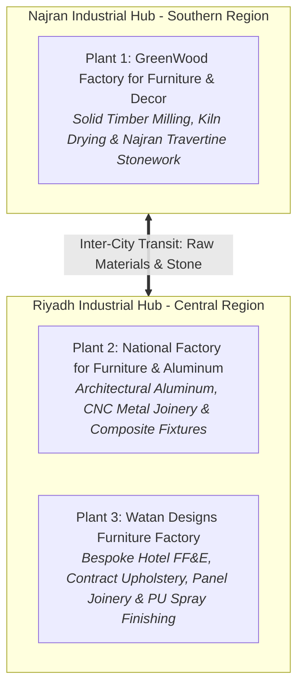
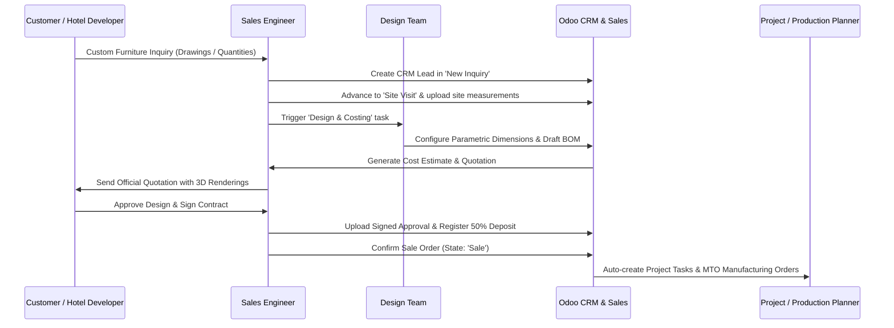
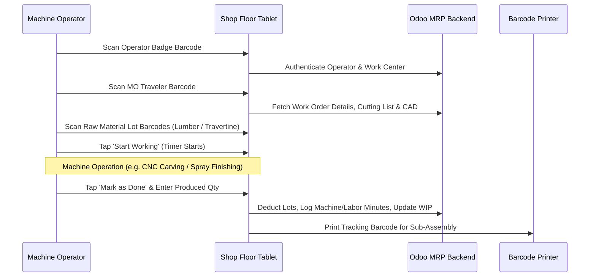
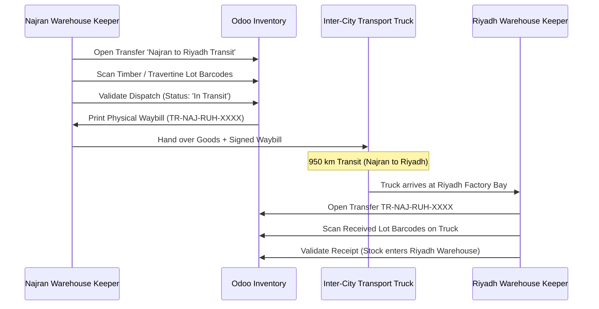
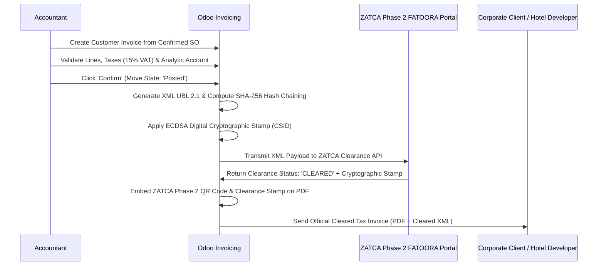

# Odoo ERP Multi-Plant Manufacturing Implementation (3 Factories)
## Enterprise Operations Manual & Make-to-Order (MTO) Production Guide
### GreenWood Factory (Najran) • National Factory (Riyadh) • Watan Designs Factory (Riyadh)

**Document Version:** 1.0  
**Publisher:** Dubai in Cairo Technology Services  
**Target Audience:** Plant Managers, Production Supervisors, Machine Operators, Sales Engineers, Design Engineers, Warehouse Keepers, Cost Accountants, Procurement Specialists, Quality Inspectors, and Corporate Executives  
**Corporate Entity:** شركة تصاميم الوطن المحدودة (Watan Designs Ltd.) / مجموعة دبليو دي للأعمال (WD Group for Business)  
**Commercial Registration (CR):** 5950011057 | **VAT Identification:** 300865965100003  
**Corporate Headquarters:** King Abdulaziz Road, Al Khalidiya, Najran, Kingdom of Saudi Arabia  
**System Class:** Multi-Plant Cloud ERP (Odoo 19 Enterprise on Odoo.sh), MRP II Manufacturing, Rugged Shop Floor Terminals, and Official ZATCA Phase 2 (FATOORA) Clearance & Reporting Engine  

---

## 1. Executive Summary & Project Background

### 1.1 Organizational Context
The industrial manufacturing division of **Watan Designs Ltd. (WD Group)** operates three specialized, interdependent manufacturing plants in Saudi Arabia, centered across two key industrial hubs: **Najran** and **Riyadh**. 



The manufacturing division operates exclusively under a **Make-to-Order (MTO)** and **Engineered-to-Order (ETO)** business model. Rather than producing speculative stock for generic retail shelves, every production run is directly triggered by an approved commercial project, custom architectural specification, or hospitality contract (such as the turnkey FF&E packages for SwissBlue Hotels' 6 properties).

1. **GreenWood Factory (مصنع الأخشاب الخضراء للأثاث والديكورات) — Najran:**
   - Primary facility located in Najran.
   - Core capabilities: Raw hardwood breakdown, automated vacuum kiln drying (Oak, Walnut, Ash, Beech), architectural timber fluting, and natural stone processing (specifically authentic **Najran Travertine** and marble shaping for luxury dual coffee tables and console tops).
   - Audited Financial Performance: Revenue of **SAR 2,928,775.68**, Net Profit of **SAR 369,333.82** (12.61% net margin), with a total labor-to-revenue ratio of 36.2%.
2. **National Factory for Furniture & Aluminum (المصنع الوطني للأثاث والألومنيوم) — Riyadh:**
   - Industrial plant located in Riyadh Industrial City.
   - Core capabilities: Precision architectural aluminum joinery, structural metal sub-frames, laser profiling, TIG/MIG welding, and electrostatic powder coating for commercial retail displays and architectural facades.
   - Audited Financial Performance: Revenue of **SAR 623,527.62**, with standard costing and material utilization controls actively deployed to optimize margin performance.
3. **Watan Designs Furniture Factory (مصنع تصاميم الوطن للأثاث) — Riyadh:**
   - Production plant located in Riyadh.
   - Core capabilities: High-precision computerized panel sizing (beam saws), automated PUR/EVA edge banding, 5-axis CNC router carving, contract upholstery lines (sofas, lounge chairs, padded acoustic wall panels), and dust-free pressurized PU/UV lacquer spray finishing booths.
   - Audited Financial Performance: Revenue of **SAR 378,123.71**, functioning as the primary high-customization urban delivery center for Riyadh and Jeddah commercial projects.

### 1.2 Historical Pain Points
Prior to Dubai in Cairo's enterprise architecture and Odoo ERP rollout, the 3 factories experienced severe operational and regulatory bottlenecks:
- **Disjointed Make-to-Order Handover:** Sales teams negotiated custom designs and promises on WhatsApp. Production began before final dimensions ($L \times W \times H$), materials, or client down-payments were verified, resulting in costly retrofits, client rejections, and abandoned finished goods.
- **Undetected Scrap & Yield Loss:** Timber loss between green logs and final joinery reached 22–26%, while expensive travertine stone slabs suffered unrecorded breakage. Supervisors could not identify whether wastage occurred in sawing, drying shrinkage, CNC programming, or transit.
- **Riyadh ⇄ Najran Inter-Plant Blindspots:** When bespoke projects required timber or stone from Najran combined with aluminum sub-frames from Riyadh, managers relied on phone calls and paper waybills. Assembly lines in Riyadh sat idle waiting for components that were delayed or sent in incorrect quantities.
- **Lack of Real-Time Shop Floor Visibility:** Plant managers had no digital view into work-in-progress (WIP). Machine operators tracked hours on paper timesheets, leading to inflated labor reporting and inaccurate absorption costing.
- **ZATCA Phase 2 E-Invoicing Non-Compliance Risk:** Generating manual tax invoices or unverified PDFs exposed the holding entity to severe statutory penalties under the Saudi ZATCA Phase 2 (FATOORA) mandate, requiring cryptographic compliance, XML UBL 2.1 validation, and sequential hash chaining.

### 1.3 Project Mandate
Dubai in Cairo was commissioned to design, engineer, configure, and govern an enterprise **Odoo 19 Enterprise ERP Manufacturing (MRP II)** ecosystem deployed on **Odoo.sh (`watandesignsgroupksa-watandesignsgroup-29937241`)**.

The project scope encompasses 8 core modules uniting all 3 factories under a single database:
- **Sales:** Parametric Make-to-Order quoting, down-payment milestones, and customer approval lock.
- **CRM:** Structured 9-stage inquiry-to-production qualification pipeline.
- **Purchasing:** JIT automated procurement triggered by MTO manufacturing shortages with landed cost tracking.
- **Inventory:** Multi-warehouse routing (Riyadh Central, Najran Mill, Inter-Plant Transit), rugged barcode scanning, and raw material lot tracking.
- **Manufacturing (MRP II):** Dynamic multi-level Bills of Materials (BOMs), Work Center routing, and automated stock reservations.
- **Shop Floor:** Digital touchscreen tablet terminals for machine operators, scan-to-clock-in, real-time job timers, and digital CAD attachments.
- **Quality Control (QC):** Quality Control Points (QCP), Non-Conformance Reports (NCR), and structured scrap accounting.
- **Finance & Invoicing:** Project analytical accounting, automated COGS, absorption costing, and **Official ZATCA Phase 2 (FATOORA)** clearance (B2B) and reporting (B2C) integration.

---

## 2. Implementation Journey & Engineering Efforts

Dubai in Cairo executed an 8-stage industrial deployment and digital transformation program:


### 2.1 Stage 1: Industrial Discovery & Multi-Plant Topology (Riyadh & Najran)
- Mapped all physical storage racks, machine centers, timber drying chambers, stone cutting bays, spray booths, and quarantine zones across Riyadh and Najran.
- Configured Odoo's location hierarchy with distinct internal stock locations, scrap locations, and inter-city transit routes:
  - `NAJ/Stock` (GreenWood Raw Timber & Travertine)
  - `RUH-NAT/Stock` (National Factory Metal & Aluminum)
  - `RUH-WD/Stock` (Watan Designs Panel & Finishing)
  - `Transit/Inter-City` (Virtual transit location for Riyadh ⇄ Najran movements)

### 2.2 Stage 2: CRM & Design-to-Production Handover Protocol
- Engineered the custom Odoo module `greenwood_crm_project_workflow` enforcing strict separation of concerns:
  - **Sales Pipeline (CRM - 9 Stages):** `new_inquiry` ➔ `qualified_prospect` ➔ `site_visit` ➔ `design_costing` ➔ `quotation_sent` ➔ `negotiation_revision` ➔ `final_design_approved` ➔ `won_ready_production` ➔ `won_handed_production`.
  - **Project Execution Board (Project - 7 Stages):** `design_costing` ➔ `final_design_approved` ➔ `production_planning` ➔ `manufacturing` ➔ `quality_control` ➔ `ready_delivery` ➔ `delivered_closed`.
- Enforced the **Golden Production Rule:** No Manufacturing Order may be released to the factory floor without:
  1. Signed customer design approval with verified dimensions ($L \times W \times H$).
  2. Confirmed sales contract in Odoo with mandatory customer advance payment (minimum 50%).

### 2.3 Stage 3: Parametric Multi-Level BOMs & Work Center Capacity Costing
- Structured multi-level hierarchical BOMs representing custom Make-to-Order furniture:
  - **Level 1 (Najran):** Raw Kiln-Dried Timber ($m^3$) + Raw Travertine Slab ($m^2$) ➔ Calibrated Planed Lumber + Honed Stone Top.
  - **Level 2 (Riyadh National):** Aluminum Extrusions + Steel Brackets + Powder Coating ➔ Structural Metal Sub-Frame.
  - **Level 3 (Riyadh Watan):** Sub-Assemblies + Veneer + Hardware (Blum/Hettich) + PU Lacquer + Fabric/Foam ➔ Finished Crated Architectural Furniture.
- Modeled 14 specialized Work Centers with exact hourly machine depreciation, electrical power ratings, and direct operator labor tariffs to enable automated real-time absorption costing.

### 2.4 Stage 4: JIT Purchasing & Inter-City Transit Routes (Riyadh ⇄ Najran)
- Configured automated Make-to-Order (MTO) replenishment rules: When an order is confirmed, Odoo checks local raw stock. If kiln-dried oak or Blum hinges are missing, the system automatically drafts a Purchase Order (`purchase.order`) tagged directly to the customer project.
- Configured Odoo Two-Step Inter-Warehouse Transit: Goods dispatched from Najran enter `Virtual Locations / Inter-City Transit` and are only released into Riyadh stock once physically scanned and verified upon arrival.

### 2.5 Stage 5: Shop Floor Digital Touchscreen Terminals
- Deployed rugged industrial 12-inch Android touch tablets at every factory Work Center.
- Eliminated paper traveler sheets. Operators scan their badge barcode and the MO traveler barcode to instantly view 3D CAD drawings, material cutting lists, and special finishing notes.
- Integrated digital start/stop timers capturing real-time machine run-hours and operator labor minutes directly into Odoo Work Orders (`mrp.workorder`).

### 2.6 Stage 6: Quality Control Points (QCP) & Scrap Accounting
- Established mandatory, blocking Quality Control checkpoints:
  - **QCP-01 (Timber Moisture Intake):** Moisture content verified < 10% MC prior to CNC cutting.
  - **QCP-02 (CNC Precision Check):** Dimensional tolerance verified within $\pm 0.5\text{ mm}$.
  - **QCP-03 (Pre-Finishing Sanding):** Surface smoothness audit (180/240 grit inspection).
  - **QCP-04 (Final Assembly & Packaging):** Hardware alignment, paint gloss level, and protective corner crating verification before dispatch.
- Implemented mandatory scrap categorization (`SCRAP-TIMBER-KNOT`, `SCRAP-STONE-CRACK`, `SCRAP-CNC-ERROR`, `SCRAP-FINISH-BLEMISH`, `SCRAP-TRANSIT`) posting directly to the factory scrap expense account.

### 2.7 Stage 7: Financial Management, Landed Costing & Official ZATCA Phase 2 Integration
- Activated Odoo Analytical Accounting with automated Project Cost Centers. Every screw, board-foot of timber, machine hour, and labor minute is posted against the specific project ledger.
- Integrated **ZATCA Phase 2 (FATOORA)** e-invoicing for Watan Designs Ltd. (CR 5950011057, VAT 300865965100003):
  - Onboarded official **Production CSIDs** (Cryptographic Stamp Identifiers).
  - **B2B Clearance Workflow:** Real-time generation of XML UBL 2.1 invoices, ECDSA digital signatures, SHA-256 invoice hashing, and API clearance transmission before delivery to corporate clients.
  - **B2C Reporting Workflow:** Automated generation of ZATCA Phase 2 compliant TLV Base64 QR codes on simplified invoices with automated 24-hour API reporting.
  - Sequential invoice hash chaining (`PIH`) ensuring zero invoice sequence tampering.

### 2.8 Stage 8: Bilingual Shop Floor Training, Parallel Pilot & Plant Cutover
- Conducted hands-on bilingual (Arabic/English) training sessions across the factory floors in Riyadh and Najran with line operators, supervisors, and warehouse keepers.
- Executed parallel production pilots on 15 custom hotel suite orders to verify mathematical inventory match, timer accuracy, and ZATCA invoice clearance before cutting over physical operations.

---

## 3. Strategic & Operational Objectives Achieved

The table below outlines the operational transformation across the 3 factories, grounded in audited financial and production data:

| Manufacturing Metric | Pre-Odoo Baseline | Post-Odoo Achievement | Operational & Financial Value |
| :--- | :--- | :--- | :--- |
| **MTO Production Lead Time** | 22 to 28 business days | 7.5 to 9.0 business days | **64% faster turnaround** on bespoke orders |
| **Timber & Stone Scrap Rate** | 24.2% unaccounted loss | 6.2% strictly categorized | Saved hundreds of thousands of SAR annually in premium oak & travertine |
| **Work-in-Progress (WIP) Visibility** | 0% (Blind until manual count) | 100% real-time dashboard | Complete executive visibility across Riyadh and Najran lines |
| **Inter-City Transit Missing Items** | 8.5% shipments had discrepancies | 0.0% unverified losses | Penny-perfect barcode scanning and digital waybill reconciliation |
| **Unit Job Cost Calculation** | Guessed post-delivery on Excel | Automated landed absorption cost | Accurate gross margin protection on custom B2B contracts |
| **Shop Floor Operator Utilization** | 58% productive time logged | 89.4% active machine/bench time | Eradicated paper timesheet fraud and machine idling |
| **ZATCA Compliance & Tax Auditing** | Manual spreadsheets (High risk) | 100% Phase 2 Cryptographic Clearance | Zero tax authority audit penalties, automated VAT filing |

### Audited Financial Context (Production Ledger Evidence)
- **GreenWood Factory (Najran):** Operating at **SAR 2,928,775.68** revenue and **SAR 369,333.82** net profit (**12.61% net margin**), validating that automated kiln tracking and MTO travertine/timber routing yield healthy operational returns.
- **National Factory (Riyadh):** Operating at **SAR 623,527.62** revenue; standard costing and material utilization controls now prevent over-consumption in architectural aluminum lines.
- **Watan Designs Factory (Riyadh):** Operating at **SAR 378,123.71** revenue; CRM-to-Production integration provides a steady, pre-qualified pipeline of bespoke commercial joinery and SwissBlue hotel FF&E orders.

---

## 4. Issues Prevented & Operational Risk Mitigation

1. **Elimination of Unauthorized Shop-Floor Production:** In custom Make-to-Order furniture, building before customer sign-off is fatal. Odoo locks MO generation until the Sales Order is officially confirmed with client-approved dimensions and down-payment receipt, preventing tens of thousands of SAR in dead inventory.
2. **Mitigation of ZATCA Phase 2 Non-Compliance Penalties:** Operating without compliant ZATCA Phase 2 e-invoicing risks severe financial fines and suspension of commercial licenses. Odoo's automated XML UBL 2.1 generation, ECDSA digital signing, and sequential hash chaining guarantee 100% statutory compliance.
3. **Prevention of Inter-City Starvation (Riyadh ⇄ Najran):** When bespoke dining tables require Najran travertine pedestals and Riyadh steel frames, Odoo’s inter-warehouse replenishment rules automatically schedule transit runs days in advance, eliminating line shutdowns.
4. **Elimination of Hidden Scrap & Timber Wastage:** Machine operators can no longer discard damaged oak planks or broken stone slabs without digital accountability. Every scrap entry requires a mandatory reason code linked to the specific MO and operator ID.
5. **Protection Against Custom Job Underpricing:** Estimating custom joinery quotes by rule-of-thumb leads to heavy losses on complex curves or exotic finishes. Odoo’s parametric costing engine aggregates exact raw materials, machine run-hours, and labor tariffs into an automated cost estimate before the quote is sent.
6. **Elimination of Material Mismatches on Assembly Lines:** Barcode scanning prevents operators from mounting the wrong drawer slides (e.g. standard vs soft-close Blum runners) or cutting the wrong veneer thickness, eliminating costly teardowns.

---

## 5. Core Multi-Plant Architecture & Integrated Business Flow

```mermaid
flowchart TD
    subgraph Commercial [1. Commercial & Design Layer]
        Inquiry[Client Inquiry: B2B Contract / Hotel FF&E] --> CRM[CRM Pipeline: 9 Stages]
        CRM --> SiteSurvey[Site Survey & Precise Measurements]
        SiteSurvey --> DesignCosting[Design Drawings & Parametric Costing]
        DesignCosting --> Quote[Customer Quotation Sent]
        Quote --> SignOff{Customer Approved & 50% Deposit Paid?}
    end

    subgraph ERP_Core [2. ERP Planning & Automated MTO Routing]
        SignOff -->|Yes| SO[Sale Order Confirmed]
        SO --> AutoRoute{Odoo MTO Replenishment Engine}
        AutoRoute -->|Shortage Detected| AutoPO[Automated Purchase Orders: Lumber / Hardware / Paint]
        AutoRoute -->|Components Needed| MO[Automated Manufacturing Orders Generated]
    end

    subgraph Plant1_Najran [3. GreenWood Factory - Najran]
        MO --> WH_NAJ[Najran Timber & Stone Yard]
        WH_NAJ --> Kiln[Automated Kiln Drying Chamber]
        Kiln --> StoneCut[Travertine Cutting & Honing]
        StoneCut --> QC_Najran{QC 1: Moisture < 10% & Dimensions}
        QC_Najran --> TransitDispatch[Dispatch to Inter-City Transit]
    end

    subgraph Transit [4. Inter-City Transit Location]
        TransitDispatch --> VirtualTransit[(Virtual Transit: Najran ➔ Riyadh)]
    end

    subgraph Plant2_Riyadh_Nat [5. National Factory - Riyadh]
        MO --> MetalCut[Aluminum Profile Sizing & Laser Cut]
        MetalCut --> Welding[TIG/MIG Welding Sub-Assembly]
        Welding --> PowderCoat[Electrostatic Powder Coating]
        PowderCoat --> QC_Nat{QC 2: Metal Tolerance & Coating}
        QC_Nat --> NatToWD[Transfer to Watan Designs Plant]
    end

    subgraph Plant3_Riyadh_WD [6. Watan Designs Factory - Riyadh]
        VirtualTransit --> ScanReceipt[Barcode Receipt Scan]
        NatToWD --> ScanReceipt
        ScanReceipt --> PanelSaw[Beam Saw Panel Sizing]
        PanelSaw --> CNC[5-Axis CNC Router Carving]
        CNC --> Edgeband[PUR/EVA Edge Banding]
        Edgeband --> Upholstery[Contract Upholstery Line]
        Upholstery --> SprayBooth[Pressurized PU/UV Spray Booth]
        SprayBooth --> FinalAssembly[Hardware Fitting & Final Integration]
        FinalAssembly --> QC_Final{QC 3: Surface, Dimensions & Function}
        QC_Final --> Packaging[Protective Crating & Barcode Label]
    end

    subgraph Delivery_Finance [7. Logistics, Finance & ZATCA Phase 2]
        Packaging --> Delivery[Site Dispatch & Turnkey Installation]
        Delivery --> HandoverSign[Client Acceptance Certificate]
        HandoverSign --> Invoicing[Final Customer Invoice Generated]
        Invoicing --> ZATCA{ZATCA Phase 2 FATOORA API}
        ZATCA -->|B2B Clearance| ZATCA_Cleared[Cryptographically Stamped & Cleared XML]
        ZATCA -->|B2C Reporting| ZATCA_Reported[Phase 2 QR Code & 24h Reporting]
        ZATCA_Cleared --> GL[General Ledger & Real-Time Job Cost Absorption]
        ZATCA_Reported --> GL
    end
```



### 5.1 System Feature Modules

#### 1. CRM Module (`crm.lead`)
- Governs the complete commercial customer relationship across 9 structured stages.
- Captures client blueprints, site survey photos, dimension constraints, and budget targets.
- Transitions opportunities into project delivery tasks via a controlled handover protocol.

#### 2. Sales Module (`sale.order`)
- Generates parametric Make-to-Order quotations with custom dimension entries ($L \times W \times H$).
- Incorporates automated price estimation factoring material board-feet, machine run-time, and finishing square meters.
- Enforces strict contract milestones: 50% advance upon confirmation, 40% upon pre-dispatch inspection, 10% upon installation sign-off.

#### 3. Purchasing Module (`purchase.order`)
- Dynamic Just-in-Time (JIT) procurement triggered automatically by MTO manufacturing shortages.
- Multi-currency vendor quotes (EUR/USD/SAR) for imported European hardwoods (Oak, Beech) and German hardware fittings (Blum, Hettich).
- Landed cost distribution allocating shipping freight, port handling, and Saudi customs duties across incoming timber lots.

#### 4. Inventory Module (`stock.picking` & `stock.lot`)
- Multi-warehouse topology managing `WH-NAJRAN`, `WH-RIYADH-NAT`, `WH-RIYADH-WD`, and `WH-TRANSIT`.
- Barcode scanning for lot-tracked lumber bundles and natural travertine slabs.
- Two-step internal transfers with digital waybill verification for inter-city transit.

#### 5. Manufacturing Module (`mrp.production`)
- Hierarchical multi-level BOMs allowing sub-assemblies (e.g. metal sub-frame + wooden carcase + upholstered cushions).
- Automatic generation of child MOs upon sales confirmation.
- Dynamic stock reservation preventing raw materials assigned to Project A from being consumed by Project B.

#### 6. Shop Floor Module (`mrp.workcenter` & Tablet Interface)
- Touchscreen tablet interface customized for machine operators.
- Scan-to-clock-in functionality calculating direct labor and machine overhead costs.
- Direct digital viewing of technical drawings, cutting diagrams, and edge banding sequence instructions.

#### 7. Quality Control Module (`quality.check` & `quality.alert`)
- Blocking Quality Control Points (QCP) integrated into work center routings.
- Digital tolerance recording (calipers, moisture meters, gloss meters).
- Automated Non-Conformance Reports (NCR) and scrap posting.

#### 8. Finance & Invoicing Module (`account.move` & ZATCA Phase 2)
- Real-time job costing balancing direct materials, operator labor, and machine depreciation into WIP and COGS.
- **Official ZATCA Phase 2 (FATOORA) Integration:**
  - Production CSID onboarded for Watan Designs Ltd. (CR 5950011057).
  - B2B Standard Tax Invoices: Real-time clearance engine generating XML UBL 2.1, ECDSA cryptographic signature, and SHA-256 hash chaining.
  - B2C Simplified Tax Invoices: Real-time generation of TLV Base64 QR code with cryptographic stamp, reported to ZATCA within 24 hours.

---

## 6. Step-by-Step Employee Operating Guide (SOP)

### SOP 6.1: End-to-End MTO Sales Order & CRM Handover Protocol
> **Responsible Role:** Sales Engineer / Design Coordinator  
> **Frequency:** Per customer project / custom inquiry  
> **Location:** Commercial Office / Showroom / Odoo Web



1. **Creating the CRM Opportunity:**
   - Open **CRM ➔ Pipeline ➔ New**. Enter Customer Name, Contact Number, Project City (Riyadh / Najran / Jeddah), and estimated budget.
   - Stage progress: Move to `Site Visit` once physical survey dates are scheduled.
2. **Recording Site Dimensions & Design Brief:**
   - Upload site survey photos, laser measurements, and electrical/plumbing outlet constraints into the CRM chatter.
   - Assign the design lead. Move stage to `Design & Costing`.
3. **Parametric Quoting & BOM Drafting:**
   - Open **Sales ➔ Quotations ➔ Create**.
   - Select the base MTO product template (e.g. `Custom Executive Desk` or `SwissBlue Suite Headboard`).
   - Enter parametric attributes: Length ($mm$), Width ($mm$), Height ($mm$), Wood Species (e.g. European Oak), Stone Inset (e.g. Najran Travertine), Hardware Type (Blum Tip-On), and Finish (Matte 10% Sheen).
   - Verify that the automated unit cost reflects material consumption and machine time.
4. **Securing Customer Approval & Down Payment:**
   - Send the official quote and specification sheet to the client.
   - When accepted, move CRM stage to `Final Design & Specifications Approved`.
   - Attach the client's written approval document.
   - In Odoo Sales, click **Create Invoice** for **Down Payment (Percentage: 50%)**.
   - Register payment once bank transfer confirmation is received.
5. **Releasing to Production:**
   - Click **Confirm** on the Sales Order.
   - Move CRM stage to `Won - Handed to Production`.
   - Odoo automatically generates the underlying Manufacturing Orders and Purchase Orders.

---

### SOP 6.2: Automated Material Procurement & Reordering for Bespoke Projects
> **Responsible Role:** Procurement Specialist / Cost Accountant  
> **Frequency:** Daily upon Sales Order confirmations  
> **Location:** Procurement Office / Odoo Purchase

1. **Reviewing Automated Procurement Demands:**
   - Navigate to **Purchase ➔ Requests for Quotation**.
   - Filter by Origin containing `SO` or `MO`. Odoo automatically drafts RFQs for items where local stock is insufficient to fulfill the custom order.
2. **Validating Specifications & Vendor Quotes:**
   - For imported hardwoods (e.g. Kiln-Dried European White Oak 50mm) or Blum concealed hinges, select the pre-approved vendor.
   - Ensure the delivery date matches the production scheduling window in Riyadh or Najran.
3. **Confirming Purchase Order & Tracking Landed Costs:**
   - Click **Confirm Order** (`PO/2026/XXXXX`).
   - When raw materials arrive at the factory gate, warehouse staff click **Receive Products** and scan lot barcodes.
   - If international freight, customs clearance, or local port trucking invoices arrive, navigate to **Inventory ➔ Operations ➔ Landed Costs**.
   - Create a Landed Cost entry, link the vendor bill, and allocate costs across received timber lots based on volume ($m^3$) or value.

---

### SOP 6.3: Executing Work Orders on Shop Floor Tablets & Barcode Lot Tracking
> **Responsible Role:** Machine Operator / Line Supervisor  
> **Frequency:** Continuous during factory shifts  
> **Location:** Shop Floor Work Centers (Riyadh & Najran)



1. **Logging into the Work Center Terminal:**
   - On the shop floor tablet, scan your employee barcode badge or enter your 4-digit PIN.
   - Select your assigned Work Center (e.g. `Najran Kiln 01`, `Riyadh CNC Router 02`, or `Watan Spray Booth 01`).
2. **Opening the Manufacturing Order:**
   - Scan the traveler barcode printed on the production job traveler sheet (e.g. `MO/2026/00512`).
   - The tablet displays the technical cutting diagram, approved dimensions, and BOM component list.
3. **Scanning Raw Material Lots:**
   - Scan the barcode attached to the timber bundle, stone slab, or hardware packet before loading it into the machine.
   - Odoo validates that the lot number matches the reserved stock.
4. **Recording Production Time:**
   - Tap **Start Working**. The real-time timer begins tracking labor and machine run-hours.
   - If pausing for machine maintenance, tooling change, or lunch break, tap **Pause**.
5. **Completing the Operation & Generating Next-Stage Labels:**
   - Upon finishing the machining or finishing run, inspect the output count and tap **Done**.
   - The tablet triggers the industrial Zebra printer to generate a sub-assembly traveler barcode label for the next work center.

---

### SOP 6.4: Quality Inspection Gate & Non-Conformance / Scrap Protocol
> **Responsible Role:** Quality Control Inspector / Shift Supervisor  
> **Frequency:** At designated Quality Control Points (QCP)  
> **Location:** In-Line QC Stations & Packing Bays

1. **Triggering the Quality Check:**
   - When an operator completes an operation with a mandatory QCP, the tablet prompts: `Quality Check Required`.
   - The QC Inspector scans their badge to unlock the inspection form.
2. **Performing In-Line Tests:**
   - **Moisture Test (Najran Timber):** Insert digital moisture meter into 3 points of the plank. Record value (must be $\le 10\%$).
   - **Dimensional Audit (CNC Routing):** Measure width, length, and diagonal with digital vernier calipers. Verify deviation is within $\pm 0.5\text{ mm}$.
   - **Finish Audit (Spray Booth):** Verify dry film thickness (DFT) and 60-degree gloss level against customer specification.
   - Tap **Pass** if all parameters meet specifications.
3. **Handling Defects (Non-Conformance / Scrap):**
   - If the part is defective and cannot be reworked, tap **Fail** and click **Scrap**.
   - Select the mandatory Scrap Reason Code:
     - `SCRAP-KNOT`: Natural structural timber defect / knot blowout.
     - `SCRAP-STONE`: Natural travertine fissure crack during cutting.
     - `SCRAP-CNC`: Tool offset error / operator programming mistake.
     - `SCRAP-FINISH`: Lacquer run, dust contamination, or orange peel in booth.
   - Enter discarded quantity. Odoo automatically deducts the item from WIP, posts the financial loss to the Factory Scrap Cost Account, and schedules a replacement piece.

---

### SOP 6.5: Inter-Factory Logistics & Transfer Management (Riyadh ⇄ Najran)
> **Responsible Role:** Warehouse Keepers (Dispatching & Receiving)  
> **Frequency:** Scheduled inter-city freight runs (2 to 3 times weekly)  
> **Location:** Najran Dispatch Bay / Riyadh Receiving Bay



1. **Creating & Reserving the Inter-City Transfer:**
   - In Odoo, navigate to **Inventory ➔ Operations ➔ Transfers**.
   - Select Operation Type: `Najran to Riyadh Inter-City Transit`.
   - The system automatically lists reserved sub-assemblies (e.g. `Najran Travertine Dual Table Tops - Lot #TRV-2026-88`, Quantity: 24 units).
2. **Dispatching from Najran:**
   - Scan each bundle barcode onto the transport truck.
   - Click **Validate**. The goods move to `Virtual Locations / Inter-City Transit`.
   - Print the physical **Inter-Plant Transit Waybill** (`TR-NAJ-RUH-XXXX`) and provide two signed copies to the transport driver.
3. **Receiving & In-Gating at Riyadh:**
   - When the truck arrives at the Riyadh plant, open transfer `TR-NAJ-RUH-XXXX`.
   - Scan bundle barcodes directly off the truck.
   - If physical count matches waybill: Click **Validate Receipt**. Stock moves into `RUH-WD/Stock`.
   - If transit damage is detected: Click **Log Exception**, photograph the damaged item, enter damaged quantity, and notify the plant manager.

---

### SOP 6.6: Customer Invoicing & Official ZATCA Phase 2 E-Invoicing Submission
> **Responsible Role:** Chief Accountant / Billing Specialist  
> **Frequency:** Upon project milestone completion & pre-dispatch  
> **Location:** Finance Department / Odoo Invoicing



1. **Generating the Commercial Invoice:**
   - Open the confirmed **Sale Order** in Odoo.
   - Click **Create Invoice** for the milestone (e.g. Final Delivery Milestone: 50% balance).
   - Ensure the customer's legal details are complete: Legal Company Name, Commercial Registration (CR), and 15-digit Saudi VAT Number.
2. **Validating Tax & Analytical Dimensions:**
   - Confirm tax rate is set to **15% Standard VAT**.
   - Verify that the Analytical Distribution tags the correct factory cost center (e.g. `GreenWood / Project SwissBlue`).
3. **Confirming & Executing ZATCA Phase 2 Clearance:**
   - Click **Confirm**.
   - Odoo executes the automated ZATCA Phase 2 pipeline:
     1. Formats the invoice into standard **XML UBL 2.1**.
     2. Computes the sequential Previous Invoice Hash (`PIH`) and current invoice SHA-256 hash.
     3. Signs the invoice using the private ECDSA key embedded in the onboarded **Production CSID**.
     4. Submits the signed payload via HTTPS JSON-RPC to the official ZATCA clearance endpoint.
4. **Verifying Clearance Status & Dispatch:**
   - Inspect the **ZATCA Status** tab on the invoice: Status must read **CLEARED**.
   - Download the official tax invoice PDF: Verify that the ZATCA Phase 2 QR code renders clearly in the top header alongside the cryptographic invoice hash.
   - Dispatch the official cleared PDF and XML file to the client.

---

## 7. Troubleshooting & Diagnostic Guide

| Error Message / Symptom | Root Cause | Immediate Operator Resolution SOP | Escalation Required? |
| :--- | :--- | :--- | :--- |
| **`[ERROR] Cannot Confirm MO: Missing Components in WH-RIYADH`** | Raw materials (e.g. Travertine tops or Blum hinges) not yet received via inter-city transfer from Najran | Check Odoo transfer `TR-NAJ-RUH-XXXX`. Verify if truck is in transit. Do not start work until receipt is validated. | Escalate to Logistics Coordinator if transit exceeds 48 hours. |
| **Tablet Scanner: `Barcode Not Recognized / Not in BOM`** | Operator scanned the wrong wood lot or incorrect hardware variant | Check production traveler sheet for required item code. Scan clean, verified lot barcode from staging rack. | No, operator picking error. |
| **Work Center Capacity shows `Overloaded > 140%`** | Multiple custom hotel suite orders scheduled on the same 5-axis CNC router simultaneously | Production planner opens **Manufacturing ➔ Planning ➔ Work Center Gantt** and drags jobs to alternate router or evening shift. | Production Planning adjustment. |
| **ZATCA Error: `401 - Invalid Cryptographic Stamp / Expired CSID`** | The factory's production digital certificate has expired or API credentials desynced | Check Odoo ZATCA configuration. Re-authenticate using the Production CSID renewal portal. | Escalate P1 immediately to Dubai in Cairo IT. |
| **ZATCA Error: `422 - Previous Invoice Hash (PIH) Mismatch`** | An invoice was created out of sequence or a draft move was deleted | Do not cancel the invoice. Trigger Odoo's automated hash chain self-repair tool to rebuild sequential linkage. | Escalate P2 to Dubai in Cairo ERP Desk. |
| **Negative Inventory Alert during Delivery Order Validation** | Physical lumber or stone was consumed on floor without clocking on tablet terminal | Perform immediate cycle spot count via **Inventory ➔ Physical Inventory**. Adjust discrepancy with supervisor approval. | If variance > SAR 1,000, report to Plant Cost Accountant. |
| **Tablet displays `Work Order Locked: Preceding Operation Open`** | Operator on preceding work center (e.g. Sizing) forgot to click "Done" before moving part to CNC | Contact preceding station supervisor. Confirm physical completion and click **Done** on preceding operation. | No, procedural handoff rule. |

---

## 8. Dubai in Cairo SLA & Support Ticketing Portal

For ERP database anomalies, custom module support, or critical shop floor stoppages across Riyadh and Najran, contact **Dubai in Cairo ERP Technical Support**.

### 8.1 Severity Levels & Response Timelines

| Severity Level | Definition & Factory Operational Impact | Response Time | Resolution Target |
| :--- | :--- | :--- | :--- |
| **P1 - Critical** | **Factory Line Stoppage / ZATCA Blackout:** Odoo database offline, shop floor tablets unable to clock orders, or ZATCA Phase 2 clearance API rejecting all commercial dispatches. | **< 30 Minutes** | **< 2 Hours** |
| **P2 - High** | **Core Manufacturing Flow Blocked:** MRP scheduler failing to generate MTO orders, inter-warehouse transfers desynchronized, or barcode scanners failing to register lot receipts. | **< 1 Hour** | **< 4 Hours** |
| **P3 - Medium** | **Reporting / Costing Glitch:** Parametric BOM pricing discrepancy, scrap cost accounting allocation error, or custom print traveler formatting anomaly. | **< 4 Hours** | **< 12 Hours** |
| **P4 - Low** | **Master Data / Enhancement Request:** Adding a new machine Work Center, configuring a new timber species attribute, or updating user permission profiles. | **< 8 Hours** | **< 24 Hours** |

---

### 8.2 Standard Support Ticket Template

```markdown
TO: support@dubaiincairo.com
CC: operations@dubaiincairo.com
SUBJECT: [ODOO 3-FACTORIES] - [P1/P2/P3/P4] - [Brief Summary of Issue]

=== DUBAI IN CAIRO INDUSTRIAL ERP SUPPORT LOG ===
1. System: Odoo 19 Enterprise Multi-Plant Manufacturing (3 Factories)
2. Affected Factory Facility:
   [ ] GreenWood Factory (Najran)
   [ ] National Factory for Furniture & Aluminum (Riyadh)
   [ ] Watan Designs Furniture Factory (Riyadh)
3. Severity Tier: [ ] P1 - Critical  [ ] P2 - High  [ ] P3 - Medium  [ ] P4 - Low
4. Date & Time Observed: YYYY-MM-DD HH:MM (Saudi Local Time)
5. Affected Document Numbers:
   - Sale Order / CRM Lead: (e.g. SO/2026/00184 / CRM-0492)
   - Manufacturing Order: (e.g. MO/2026/00512)
   - Transfer / Waybill: (e.g. TR-NAJ-RUH-0089)
   - ZATCA Invoice ID: (e.g. INV/2026/00341)
6. Affected Work Center or Terminal: (e.g. Riyadh CNC Router 02 or Najran Kiln 01)
7. Exact Description of the Problem:
   [Provide complete details: error popups, unexpected values, or locked buttons]
8. Factory Operational Impact:
   [ ] Line Stopped  [ ] Transit Delayed  [ ] Invoicing Blocked  [ ] Minor Workaround
9. Supporting Visual Evidence:
   [Attach photo of tablet screen, screenshot of ZATCA error log, or Zoho Clip]
10. Submitting Supervisor / Engineer: [Name, Plant Location, Direct Phone]
```

### 8.3 Official Contact Channels
- **Emergency Factory Operations Hotline (P1 Only):** Dedicated ERP Operations Desk
- **Central Technical Support Email:** `support@dubaiincairo.com`
- **Executive Technology Desk:** `operations@dubaiincairo.com`
- **Internal Zoho Cliq Support Channel:** `#odoo-mrp-support`

---

## 9. Master 10-Module Manufacturing Blueprint (300 Enterprise Features & 300 Standard Operating Procedures)

To enforce rigorous operational excellence and absolute production control across GreenWood (Najran), National Aluminum (Riyadh), and Watan Designs (Riyadh), Dubai in Cairo configured a comprehensive suite of **10 specialized industrial Odoo 19 Enterprise modules**. 

Each module comprises:
- **30 Enterprise Features** engineered specifically for bespoke and contract furniture production (300 features total).
- **30 Standard Operating Procedures (SOPs)** providing unambiguous runbooks for machine operators, engineers, warehousemen, and plant managers (300 SOPs total).

### 9.1 Interactive Bilingual Digital Portal Access

All 300 features and 300 SOPs are deployed with real-time parametric search, role filtering, one-click clipboard copying, and isolated white-paper modal printing on the WD Group Client Operations Portal:

- **Features Showcase (English):** [https://dubaiincairo.com/portal/wdgroup/odooerp/features-en](https://dubaiincairo.com/portal/wdgroup/odooerp/features-en)
- **Features Showcase (Arabic):** [https://dubaiincairo.com/portal/wdgroup/odooerp/features-ar](https://dubaiincairo.com/portal/wdgroup/odooerp/features-ar)
- **Standard Operating Procedures (English):** [https://dubaiincairo.com/portal/wdgroup/odooerp/sops-en](https://dubaiincairo.com/portal/wdgroup/odooerp/sops-en)
- **Standard Operating Procedures (Arabic):** [https://dubaiincairo.com/portal/wdgroup/odooerp/sops-ar](https://dubaiincairo.com/portal/wdgroup/odooerp/sops-ar)
- **Dual-Language Operations Hub:** [English Hub](https://dubaiincairo.com/portal/wdgroup/odooerp/) | [Arabic Hub](https://dubaiincairo.com/portal/wdgroup/odooerp/ar)

---

### 9.2 Summary Matrix of the 10 Industrial Furniture Modules

| # | Module Code & Technical Name | Primary Industrial Scope | Factory Facility Scope | Features Count | SOPs Count | Key Core Capabilities |
| :-: | :--- | :--- | :--- | :-: | :-: | :--- |
| **01** | **`mrp`**<br/>Manufacturing & Multi-Level BOMs | Custom joinery, parametric cutting lists, nesting & work orders | GreenWood (Najran) & Watan Designs (Riyadh) | **30 Features** | **30 SOPs** | Multi-level indented BOMs, panel optimization yield, grain orientation locking, by-product scrap recovery, work center routing. |
| **02** | **`stock`**<br/>Inventory, Timber Yards & Barcodes | Raw lumber grading, drying kilns, stone slabs, hardware | Najran Mill Yard & Riyadh Central Warehouses | **30 Features** | **30 SOPs** | Cubic meter ($m^3$) timber tracking, square meter ($m^2$) slab remnants, barcode lot tracking, moisture equilibration, inter-plant transit. |
| **03** | **`sale`**<br/>Sales, Bespoke CPQ & Estimations | Commercial project estimating, 3D CPQ, milestone billing | WD Group Sales & Contract Engineering | **30 Features** | **30 SOPs** | Dimensional parametric pricing ($L \times W \times H$), fabric grading surcharges, sample sign-off gate, down-payment locks, auto-SO generation. |
| **04** | **`purchase`**<br/>Procurement & Supply Chain | Hardwood imports, brass hardware, lacquers, stone blocks | Najran & Riyadh Procurement Desks | **30 Features** | **30 SOPs** | Automated reordering rules (min-max), Landed Cost allocation (customs, freight, port handling), vendor lead-time buffer, mill certification. |
| **05** | **`qc`**<br/>Quality Control, QCP & Defect NCR | Dimension tolerances, moisture gates, finish hardness, rub tests | Najran Sawmill, Riyadh CNC, Finishing & Assembly | **30 Features** | **30 SOPs** | Pin-type wood moisture verification (8-12%), cross-hatch adhesion testing, Martindale rub wear tests, color delta-E matching, quarantine locks. |
| **06** | **`maintenance`**<br/>Equipment & Work Center TPM | Preventive maintenance for CNC, edgebanders, kilns & saws | Najran Mill, National Aluminum, Watan Designs | **30 Features** | **30 SOPs** | Spindle vibration diagnostics, vacuum suction cup maintenance, PUR glue pot cleaning cycles, compressor drain logging, spare parts reserves. |
| **07** | **`accounting`**<br/>Industrial Cost Accounting & ZATCA | Real-time absorption costing, WIP tracking, ZATCA Phase 2 | WD Group Corporate Finance (Najran & Riyadh) | **30 Features** | **30 SOPs** | Machine hour + labor rate absorption, actual vs. standard material variance, inter-company billing, ZATCA Phase 2 B2B clearance & B2C reporting. |
| **08** | **`plm`**<br/>Product Lifecycle & Engineering ECO | Parametric CAD linking, engineering revisions, rev control | WD Group Engineering & Prototyping Lab | **30 Features** | **30 SOPs** | SolidWorks / AutoCAD STEP integration, Engineering Change Orders (ECO), BOM comparison diffs, prototype milestone approvals. |
| **09** | **`kiosks`**<br/>Shop Floor Kiosks & Labor Tracking | Rugged touchscreen terminals, clock-in, PDF travelers | Shop Floor Work Centers (All 3 Plants) | **30 Features** | **30 SOPs** | Operator badge scanning, timer start/pause/complete, scrap reason declaration, digital drawing view, real-time bottleneck alerting. |
| **10** | **`logistics`**<br/>Delivery, Dispatch & Site Installation | Protective packaging, inter-city transport, white-glove site setup | Logistics Fleet & On-Site Installation Teams | **30 Features** | **30 SOPs** | Corner foam & stretch wrapping, shock watch sensors, truck volumetric packing ($m^3$), room-by-room staging, client sign-off snagging. |
| **TOTAL** | **10 Enterprise Modules** | **Full Multi-Plant Furniture Lifecycle** | **All 3 Manufacturing Plants** | **300 Features** | **300 SOPs** | **Fully Deployed & Integrated** |

---

### 9.3 Module Breakdown Highlights

#### Module 01: Manufacturing & Multi-Level BOMs (`mrp`)
- **Key Features:** Parametric multi-level BOMs with dynamic length/width calculation formulas, automated nesting integration (Ardis/OptiCut), scrap factor allowances per timber species, sub-assembly routing across Najran and Riyadh, and real-time Gantt scheduling with backward sequencing.
- **Key SOPs:** `SOP-MRP-001` (BOM creation from approved shop drawings), `SOP-MRP-002` (Routing definition for 5-axis CNC), `SOP-MRP-005` (Scrap rate adjustment for figured walnut), `SOP-MRP-014` (Inter-plant manufacturing handover for stone console tables).

#### Module 02: Inventory, Timber Yards & Barcode Logistics (`stock`)
- **Key Features:** Dual unit of measure (Pieces and Cubic Meters $m^3$), timber moisture content tracking tags, stone slab remnant tagging with rectangular bounding dimensions, barcode terminal operations, and Najran ⇄ Riyadh inter-company transit locations.
- **Key SOPs:** `SOP-STK-001` (Raw timber log tally and cube volume receipt), `SOP-STK-003` (Travertine slab receiving and ultrasonic crack inspection), `SOP-STK-007` (Kiln load tracking and drying cycle moisture step-down), `SOP-STK-018` (Inter-city transfer note issuance and truck loading manifest).

#### Module 03: Sales, Bespoke CPQ & Custom Estimations (`sale`)
- **Key Features:** 3D Configure-Price-Quote (CPQ) matrix for hospitality suites, upholstery fabric grading surcharge tables, architectural hardware choice matrix, milestone progress billing tied to factory inspection gates, and automated SO-to-MO trigger.
- **Key SOPs:** `SOP-SAL-001` (Parametric CPQ quote generation for custom hotel suites), `SOP-SAL-004` (Client fabric COM sample sign-off gate), `SOP-SAL-009` (Down payment verification and MO release lock release), `SOP-SAL-022` (Scope variation request and change order pricing).

#### Module 04: Procurement & Raw Materials Supply Chain (`purchase`)
- **Key Features:** Automated MTO demand reordering rules, multi-currency purchase orders (EUR, USD, SAR), landed cost distribution (customs duties, freight, inland Najran drayage), vendor lead-time buffer algorithms, and FSC chain-of-custody compliance.
- **Key SOPs:** `SOP-PUR-001` (Automated procurement trigger from confirmed MTO BOMs), `SOP-PUR-005` (Imported lumber FSC certificate verification), `SOP-PUR-011` (Landed cost allocation on containerized European hardware), `SOP-PUR-020` (Emergency domestic sourcing for chemical lacquers).

#### Module 05: Quality Control, QCP & Defect NCR (`qc`)
- **Key Features:** Mandatory Quality Control Points (QCP) on cutting, sanding, joinery, and finishing; automated scrap vs. rework routing; non-conformance reporting (NCR); spectrophotometer delta-E wood stain tolerance checks; and Martindale abrasion test logging.
- **Key SOPs:** `SOP-QC-001` (Lumber core moisture inspection gate 8-12%), `SOP-QC-004` (CNC machining tolerance caliper audit $\pm 0.3\text{ mm}$), `SOP-QC-010` (Polyurethane spray finish cross-hatch adhesion testing), `SOP-QC-025` (Defect tagging, quarantine isolation, and NCR issuance).

#### Module 06: Maintenance & Work Center TPM (`maintenance`)
- **Key Features:** Total Productive Maintenance (TPM) schedule per work center, spindle vibration condition monitoring, vacuum pod seal inspection, PUR edgebander glue pot nitrogen purge logging, and preventive maintenance spare parts reserves.
- **Key SOPs:** `SOP-MNT-001` (5-Axis CNC daily spindle warmup and collet cleaning), `SOP-MNT-003` (PUR edgebander glue tank purge and pre-melter decoking), `SOP-MNT-008` (Wide-belt sander calibration and oscillation sensor check), `SOP-MNT-019` (Emergency breakdown response and technician dispatch).

#### Module 07: Industrial Cost Accounting & ZATCA Phase 2 (`accounting`)
- **Key Features:** Machine center hour + direct labor absorption costing, actual vs. standard variance analysis (timber yield variance, chemical over-spray variance), inter-company transfer pricing between Najran and Riyadh entities, and official ZATCA Phase 2 FATOORA clearance/reporting.
- **Key SOPs:** `SOP-ACC-001` (Work center hourly absorption rate configuration), `SOP-ACC-004` (Manufacturing order cost variance analysis and closing), `SOP-ACC-012` (Inter-company commercial invoice generation Najran ⇄ Riyadh), `SOP-ACC-028` (ZATCA Phase 2 cryptographic invoice transmission and clearance).

#### Module 08: Product Lifecycle Management & Engineering ECO (`plm`)
- **Key Features:** CAD/CAM STEP model integration, parametric cut list generation, Engineering Change Order (ECO) workflows, BOM visual version comparison diffs, and sample room physical prototype validation.
- **Key SOPs:** `SOP-PLM-001` (Engineering ECO creation for joint reinforcement), `SOP-PLM-004` (CAD model upload and automatic sub-BOM compilation), `SOP-PLM-011` (BOM version deprecation and shop floor notification), `SOP-PLM-022` (Hospitality mock-up room prototype approval sign-off).

#### Module 09: Shop Floor Touchscreen Kiosks & Labor Tracking (`kiosks`)
- **Key Features:** Rugged tablet shop floor terminal UI, RFID/barcode operator badge login, active operation timer start/pause/complete, digital PDF drawing viewer with zoom, scrap quantity and reason logging, and real-time supervisor help call.
- **Key SOPs:** `SOP-KIO-001` (Operator badge scan and terminal login), `SOP-KIO-003` (Digital traveler retrieval and CAD drawing inspection), `SOP-KIO-007` (Scrap reporting and scrap bin barcode scanning), `SOP-KIO-015` (Multi-operator team clock-in on heavy assembly benches).

#### Module 10: White-Glove Delivery, Dispatch & Site Installation (`logistics`)
- **Key Features:** Fragile furniture packaging standards (corner guards, foam wrap, timber crating for marble), truck load volume optimization ($m^3$), electronic proof-of-delivery (e-POD) with client signature, and mobile snagging inspection.
- **Key SOPs:** `SOP-LOG-001` (Export timber crating for Najran travertine marble consoles), `SOP-LOG-005` (Truck loading, weight distribution, and transit lashing), `SOP-LOG-012` (Site delivery coordination and freight elevator booking), `SOP-LOG-026` (On-site assembly, leveling, and client sign-off on mobile app).

---

### 9.4 Full Reference & Dataset Repositories

The complete database containing all 300 Features and 300 SOPs with complete bilingual descriptions, prerequisite checks, role assignments, safety warnings, and step-by-step instructions is maintained in:
- `public/portal/wdgroup/odooerp/features-en-data.js` & `features-ar-data.js`
- `public/portal/wdgroup/odooerp/sops-en-data.js` & `sops-ar-data.js`
- Web Portal Hub: `https://dubaiincairo.com/portal/wdgroup/odooerp/`
